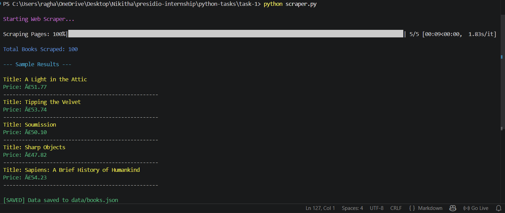

# Task 1: Web Scraper with Pagination and CLI Output

## Objective

The objective of this task is to build a Python-based web scraper that extracts structured data from a website, handles pagination, and presents the output in a clean and interactive format.

---

## Features

* Scrapes book data (title and price) from a website
* Handles multiple pages (pagination)
* Displays progress using a progress bar
* Provides colored and structured CLI output
* Saves extracted data into a JSON file
* Includes basic error handling for failed requests

---

## Project Structure

```
task-1/
│
├── scraper.py
├── requirements.txt
└── data/
    └── books.json
```

---

## Installation

Install the required dependencies:

```
pip install -r requirements.txt
```

---

## How to Run

Execute the script using:

```
python scraper.py
```

---

## Output


### Terminal Output

The script displays progress and results directly in the terminal:

```
Starting Web Scraper...

Scraping Pages: 100%|████████████████████████████████████████████████████████████████████████████████████████████████████████████| 5/5 [00:09<00:00,  1.83s/it]

Total Books Scraped: 100

--- Sample Results ---

Title: A Light in the Attic
Price: £51.77
--------------------------------------------------
Title: Tipping the Velvet
Price: £53.74
--------------------------------------------------
Title: Soumission
Price: £50.10
--------------------------------------------------
Title: Sharp Objects
Price: £47.82
--------------------------------------------------
Title: Sapiens: A Brief History of Humankind
Price: £54.23
--------------------------------------------------

[SAVED] Data saved to data/books.json
```

You can include a screenshot of this output here for visual reference.

---

### Saved Output File

The scraped data is stored in:

```
data/books.json
```

This file contains structured JSON data of all scraped books.

---

## Key Concepts Used

* HTTP requests using `requests`
* HTML parsing using `BeautifulSoup`
* Pagination handling
* CLI enhancements using `colorama` and `tqdm`
* File handling and JSON storage

---

## What I Learned

This task helped in understanding how to:

* Extract structured data from web pages
* Handle multiple pages efficiently
* Improve user experience using CLI enhancements
* Store and manage scraped data

---

## Conclusion

This task demonstrates a practical implementation of web scraping with a focus on usability and structured output. It lays the foundation for more advanced scraping techniques such as handling dynamic content, implementing retries, and bypassing anti-bot mechanisms.
