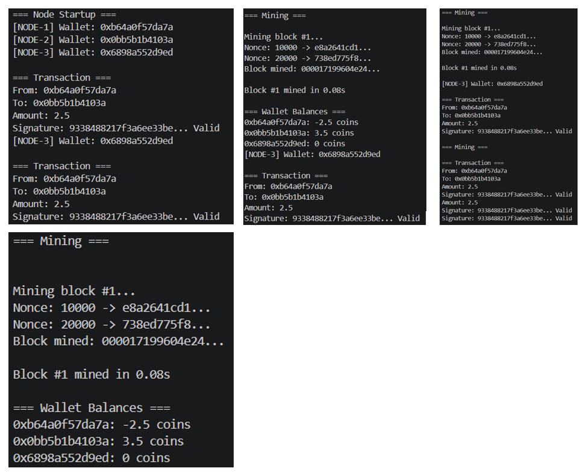

# Task 10: Blockchain Prototype with Proof-of-Work and Wallet System

## Objective

The objective of this task is to implement a simplified blockchain system that supports transaction creation, digital signing, proof-of-work mining, and wallet-based balance tracking. The system simulates multiple nodes interacting within a blockchain network.

---

## Features

* Wallet generation using public-key cryptography (ECDSA)
* Transaction creation and digital signing
* Proof-of-Work mining with configurable difficulty
* Block creation and chain linking
* Mining rewards system
* Balance calculation for wallets
* Multi-node simulation within a single runtime

---

## Project Structure

```plaintext id="3j9k1f"
task-10/
│
├── blockchain.py
├── wallet.py
├── transaction.py
├── main.py
├── requirements.txt
```

---

## Prerequisites

* Python 3.x
* Understanding of hashing and blockchain fundamentals

---

## Installation

Install required dependencies:

```bash id="x9r3q7"
pip install -r requirements.txt
```

---

## How to Run

```bash id="l2p6z1"
python main.py
```

---

## Output

### Node Startup

```plaintext id="c4k7n2"
=== Node Startup ===
[NODE-1] Wallet: 0xa3f8c1d2
[NODE-2] Wallet: 0xb7d4e5f6
[NODE-3] Wallet: 0xc9e2a7b8
```

---

### Transaction Creation

```plaintext id="d8m5q9"
=== Transaction ===
From:   0xa3f8c1d2
To:     0xb7d4e5f6
Amount: 2.5 coins
Signature: 3045022100...  Valid
```

---

### Mining Process

```plaintext id="v7p2t6"
=== Mining ===
Mining block #1...
Nonce: 10000 -> 8a3f1b...
Nonce: 20000 -> c72de9...
...
Block mined: 0000a8f3c1d2b7e4...

Block #1 mined in 3.42s
```

---

### Wallet Balances

```plaintext id="z1q8n4"
=== Wallet Balances ===
0xa3f8c1d2:  0.0 coins
0xb7d4e5f6:  1.0 coins
0xc9e2a7b8:  0.0 coins
```

---

### Output Screenshot


---

## Key Concepts Used

* Blockchain data structure (linked blocks)
* SHA-256 hashing for block integrity
* Proof-of-Work consensus algorithm
* Public-key cryptography for wallet and signatures
* Transaction validation and reward mechanism

---

## What I Learned

This task helped in understanding:

* How blockchain networks validate and store transactions
* The concept of mining and nonce-based hashing
* Digital signatures and wallet identity
* How distributed systems maintain consistency
* Core principles behind cryptocurrencies

---

## Conclusion

This blockchain prototype demonstrates the fundamental components of a decentralized ledger system. It provides a simplified yet practical understanding of how transactions, mining, and validation work together in blockchain technology.
