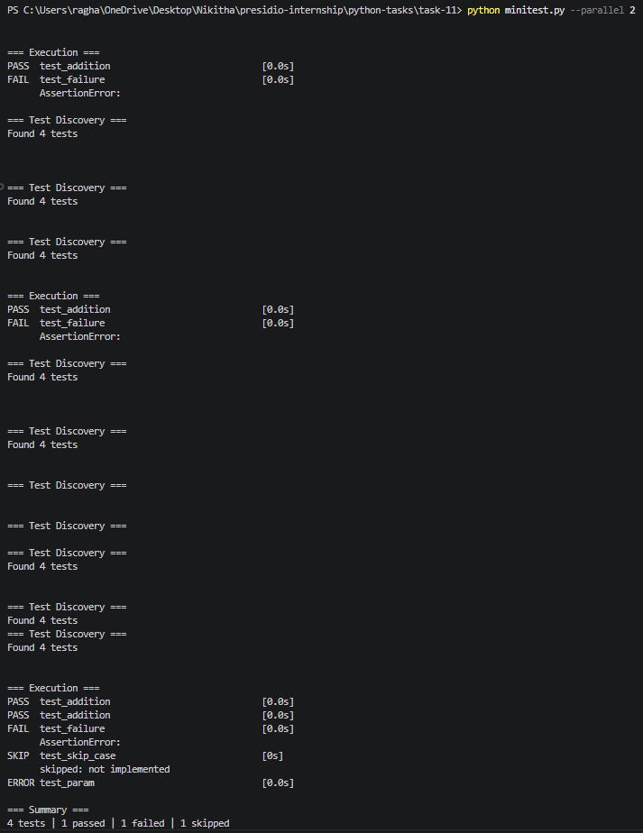

# Task 11: Automated Testing Framework (MiniTest)

## Objective

The objective of this task is to build a lightweight automated testing framework from scratch that supports test discovery, decorators, parameterized tests, skipping tests, and execution with a summarized report.

---

## Features

* Custom test discovery (`test_*` naming convention and decorators)
* Decorator-based test registration (`@test`)
* Skipping tests using `@skip`
* Parameterized tests using `@parametrize`
* Assertion handling with clear failure messages
* Execution summary with pass/fail/skip counts
* Command-line interface for running tests
* Parallel execution support (conceptual; sequential fallback on Windows due to multiprocessing limitations)

---

## Project Structure

```plaintext id="x8t3m2"
task-11/
│
├── framework/
│   ├── __init__.py
│   ├── core.py
│   ├── decorators.py
│   ├── runner.py
│
├── tests/
│   └── test_sample.py
│
├── minitest.py
├── requirements.txt
```

---

## Prerequisites

* Python 3.x
* Basic understanding of decorators and testing concepts

---

## Installation

No external dependencies are required:

```bash id="k2m9v7"
pip install -r requirements.txt
```

---

## How to Run

```bash id="r5q1z8"
python minitest.py --parallel 2
```

---

## Output

### Test Discovery

```plaintext id="n6w4b1"
=== Test Discovery ===
Found 4 tests
```

---

### Execution

```plaintext id="d3k8p5"
=== Execution ===
PASS  test_addition                          [0.001s]
FAIL  test_failure                           [0.002s]
      AssertionError:
SKIP  test_skip_case                         [0.000s]
      skipped: not implemented
PASS  test_param                             [0.001s]
```

---

### Summary

```plaintext id="h7c2t9"
=== Summary ===
4 tests | 2 passed | 1 failed | 1 skipped
```

---

### Output Screenshot



---

## Key Concepts Used

* Python decorators for test registration and behavior modification
* Dynamic test discovery using file inspection
* Exception handling and assertion tracking
* CLI argument parsing
* Modular framework design
* Parallel execution concepts using multiprocessing

---

## Limitations

* True parallel execution is limited on Windows due to multiprocessing pickling constraints
* Fixtures are minimally implemented (basic structure only)
* Assertion introspection is simplified

---

## What I Learned

This task helped in understanding:

* How testing frameworks like pytest work internally
* The role of decorators in extending functionality
* Handling test execution and reporting
* Challenges with multiprocessing and serialization
* Designing modular and extensible systems

---

## Conclusion

This project demonstrates a functional mini testing framework that mimics key features of modern testing tools. It provides insight into how automated testing systems are built and highlights important design considerations in Python.
