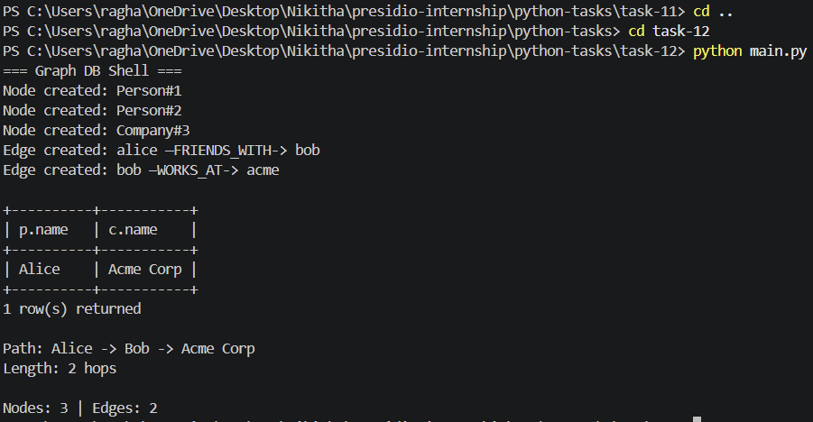

# Task 12: In-Memory Graph Database Engine

## Objective

The objective of this task is to implement a lightweight in-memory graph database that supports node and edge creation, graph traversal queries, shortest path computation, and persistence using a write-ahead logging (WAL) mechanism.

---

## Features

* Creation of typed nodes with labels and properties
* Creation of directed, typed edges between nodes
* Graph traversal queries (multi-hop relationships)
* Shortest path computation using BFS
* Write-Ahead Logging (WAL) for persistence
* Simple query execution and CLI-based interaction
* Basic indexing using in-memory mapping

---

## Project Structure

```plaintext
task-12/
│
├── graph.py
├── storage.py
├── query.py
├── main.py
├── wal.log
├── requirements.txt
```

---

## Prerequisites

* Python 3.x
* Basic understanding of graph theory and data structures

---

## Installation

No external dependencies are required:

```bash
pip install -r requirements.txt
```

---

## How to Run

```bash
python main.py
```

---

## Output

### Graph Initialization

```plaintext
=== Graph DB Shell ===
Node created: Person#1
Node created: Person#2
Node created: Company#3
```

---

### Edge Creation

```plaintext
Edge created: alice —FRIENDS_WITH-> bob
Edge created: bob —WORKS_AT-> acme
```

---

### Query Result

```plaintext
+----------+-----------+
| p.name   | c.name    |
+----------+-----------+
| Alice    | Acme Corp |
+----------+-----------+
1 row(s) returned
```

---

### Shortest Path

```plaintext
Path: Alice -> Bob -> Acme Corp
Length: 2 hops
```

---

### Database Stats

```plaintext
Nodes: 3 | Edges: 2
```

---

### Output Screenshot



---

## Key Concepts Used

* Graph data structures (nodes, edges, adjacency traversal)
* Breadth-First Search (BFS) for shortest path
* Query pattern matching for multi-hop traversal
* Write-Ahead Logging (WAL) for persistence
* In-memory indexing and data storage

---

## What I Learned

This task helped in understanding:

* How graph databases like Neo4j work internally
* Implementing traversal queries and relationship-based filtering
* Designing simple query execution engines
* Persistence strategies using logging mechanisms
* Applying graph algorithms in real-world systems

---

## Conclusion

This project demonstrates a functional graph database engine with core capabilities such as traversal, pathfinding, and persistence. It highlights how graph-based data models can efficiently represent and query relationships between entities.
