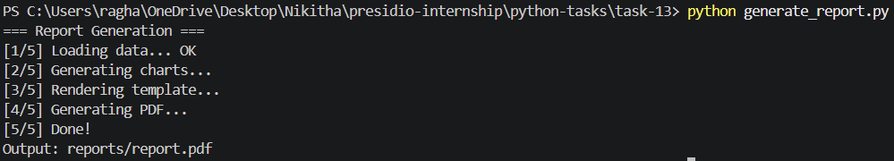

# Task 13: PDF Report Generator with Templating

## Objective

The objective of this task is to build a system that generates structured PDF reports by combining data, templates, and visualizations. The system processes sales data, renders it using a template engine, generates charts, and produces a polished PDF report.

---

## Features

* Data ingestion and processing (mock database simulation)
* Chart generation using matplotlib (bar chart and line chart)
* Template rendering using Jinja2
* PDF generation using ReportLab
* Conditional content rendering (warning sections)
* Automated report creation pipeline

---

## Project Structure

```plaintext id="g6x1m9"
task-13/
│
├── generate_report.py
├── db.py
├── charts.py
├── template.html
├── reports/
├── requirements.txt
```

---

## Prerequisites

* Python 3.x
* Basic understanding of templating and data processing

---

## Installation

Install required dependencies:

```bash id="q9v2x4"
pip install -r requirements.txt
```

---

## How to Run

```bash id="n3k8z1"
python generate_report.py
```

---

## Output

### Report Generation Logs

```plaintext id="d8f3k6"
=== Report Generation ===
[1/5] Loading data... OK
[2/5] Generating charts...
[3/5] Rendering template...
[4/5] Generating PDF...
[5/5] Done!

Output: reports/report.pdf
```

---

### Generated Report Contents

* Monthly sales summary (total revenue, units sold, average order value)
* Bar chart showing revenue distribution by region
* Line chart showing daily sales trend
* Conditional warning section (if a region underperforms)

---

### Output Screenshot



---

## Key Concepts Used

* Template rendering using Jinja2
* Data visualization using matplotlib
* PDF generation using ReportLab
* Conditional rendering logic
* File handling and report automation

---

## What I Learned

This task helped in understanding:

* How reporting systems generate structured documents
* Integrating data, templates, and visualizations
* Generating professional PDFs programmatically
* Handling conditional sections in reports
* Building end-to-end data pipelines

---

## Conclusion

This project demonstrates a complete reporting workflow, from data processing to PDF generation. It reflects real-world applications such as business reporting systems, analytics dashboards, and automated document generation.
