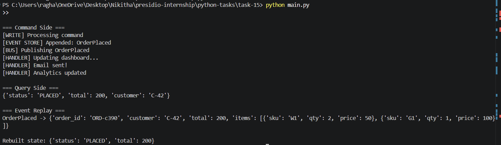

# Task 15: Event-Driven Microservice with CQRS Pattern

## Objective

Implement a microservice architecture using CQRS (Command Query Responsibility Segregation) and event sourcing.

---

## Features

- Command side for write operations  
- Event sourcing with append-only event store  
- Event bus for async communication  
- Read model for fast queries  
- Event replay for audit and reconstruction  

---

## Project Structure

task-15/
│
├── commands.py  
├── events.py  
├── bus.py  
├── store.py  
├── handlers.py  
├── read_model.py  
├── main.py  

---

## How to Run

python main.py

---

## Output

---

## Concepts Used

- CQRS pattern  
- Event sourcing  
- Async event handling  
- Read/write separation  
- Domain-driven design  

---

## Conclusion

This system demonstrates how modern distributed architectures handle scalability and consistency using event-driven patterns.