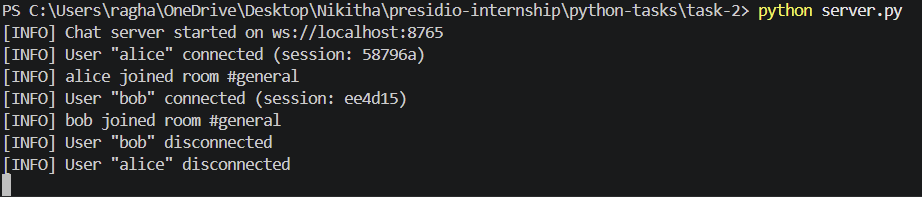

# Task 2: Real-Time Chat Application with WebSockets

## Objective

The objective of this task is to build a real-time chat application using WebSockets that supports multiple users, live messaging, typing indicators, and user presence tracking.

---

## Features

* Real-time messaging using WebSockets
* Multi-user chat in a shared room (#general)
* Typing indicator functionality
* Online users list
* Interactive browser-based UI
* Asynchronous server handling multiple clients

---

## Project Structure

```plaintext
task-2/
│
├── server.py
├── client.html
└── requirements.txt
```

---

## Installation

Install the required dependencies:

```bash
pip install -r requirements.txt
```

---

## How to Run

### Step 1: Start the Server

```bash
python server.py
```

Server will start at:

```
ws://localhost:8765
```

---

### Step 2: Open the Client

* Open `client.html` in a browser
* Open multiple tabs to simulate different users

---

### Step 3: Join Chat

* Enter a username (e.g., alice, bob)
* Click "Join"
* Start sending messages

---

## Output



### Server Log

```plaintext
[INFO] Chat server started on ws://localhost:8765
[INFO] User "alice" connected
[INFO] User "bob" connected
[INFO] alice joined room #general
[INFO] bob joined room #general
```

---

### Client View

```plaintext
#general | 2 members online
──────────────────────────────
alice: hi
bob: hello
bob is typing...
alice: how are you?
──────────────────────────────
Online: alice, bob


---

## Key Concepts Used

* WebSockets for real-time communication
* Asynchronous programming using asyncio
* JSON-based message exchange
* Client-server architecture
* Browser-based UI with HTML and JavaScript

---

## What I Learned

This task helped in understanding:

* How real-time systems work using WebSockets
* Handling multiple users concurrently
* Implementing interactive features like typing indicators
* Building a simple frontend connected to a backend server

---

## Conclusion

This task demonstrates a functional real-time chat application with core communication features. It provides a strong foundation for building more advanced systems with private messaging, multiple rooms, and persistent storage.
