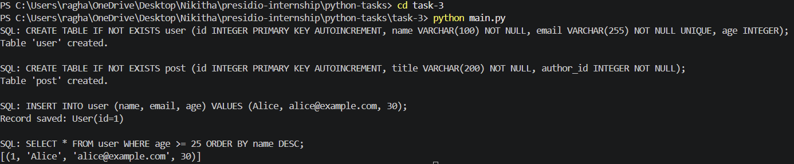

# Task 3: Custom ORM (Object-Relational Mapper)

## Objective

The objective of this task is to design and implement a lightweight Object-Relational Mapper (ORM) in Python using metaclasses and descriptors. The ORM allows defining database tables as Python classes and performing CRUD operations through an intuitive interface.

---

## Features

* Define database tables using Python classes
* Automatic SQL table generation
* Insert records using `.save()`
* Query data using `.filter()` and `.order_by()`
* Support for field types (CharField, IntegerField)
* Basic ForeignKey relationship support
* Dynamic SQL generation and execution

---

## Project Structure

```plaintext id="q9z2pi"
task-3/
│
├── orm.py
├── models.py
├── main.py
└── database.db
```

---

## How to Run

Execute the main script:

```bash id="g0jv9h"
python main.py
```

---

## Example Usage

```python id="1pl2um"
class User(Model):
    name = CharField(max_length=100)
    email = CharField(max_length=255, unique=True)
    age = IntegerField(nullable=True)

class Post(Model):
    title = CharField(max_length=200)
    author = ForeignKey(User)
```

---

## Output

### Terminal Output

```plaintext id="9t0bdl"
SQL: CREATE TABLE IF NOT EXISTS user (
       id INTEGER PRIMARY KEY AUTOINCREMENT,
       name VARCHAR(100) NOT NULL,
       email VARCHAR(255) NOT NULL UNIQUE,
       age INTEGER
     );
Table 'user' created.

SQL: INSERT INTO user (name, email, age) VALUES ('Alice', 'alice@example.com', 30);
Record saved: User(id=1)

SQL: SELECT * FROM user WHERE age >= 25 ORDER BY name DESC;
[(1, 'Alice', 'alice@example.com', 30)]
```

---

### Output Screenshot


---

## Key Concepts Used

* **Metaclasses** (`ModelMeta`) to dynamically process model definitions
* **Descriptors** (`Field`) to manage attribute access and validation
* **Dynamic SQL generation** for table creation and queries
* **SQLite integration** using `sqlite3`
* **Query builder pattern** for chaining filters and ordering

---

## What I Learned

This task helped in understanding:

* How ORMs abstract database interactions
* Internal working of frameworks like Django ORM
* Advanced Python concepts like metaclasses and descriptors
* Building reusable and scalable abstractions

---

## Conclusion

This custom ORM demonstrates how database operations can be simplified using Python abstractions. It provides a foundational understanding of how modern web frameworks handle data models and queries internally.
