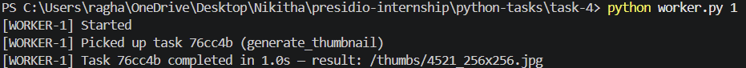
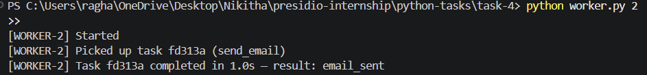
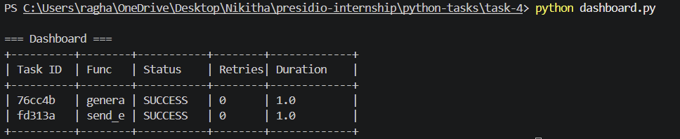

# Task 4: Distributed Task Queue with Retry and Dead-Letter Handling

## Objective

The objective of this task is to design and implement a distributed task queue system using Python and Redis. The system follows a producer-consumer architecture where tasks are queued, processed by multiple workers, retried on failure with exponential backoff, and stored with their results.

---

## Features

* Producer enqueues tasks with arguments
* Multiple worker processes consume tasks concurrently
* Retry mechanism with exponential backoff (2s, 4s, 8s)
* Dead-letter queue for permanently failed tasks
* Result backend using Redis
* Dashboard view displaying task status and execution details

---

## Project Structure

```plaintext id="4j8n3v"
task-4/
│
├── broker.py
├── worker.py
├── producer.py
├── dashboard.py
├── tasks.py
└── requirements.txt
```

---

## Prerequisites

* Python 3.x
* Redis running locally

---

## Installation

Install dependencies:

```bash id="p3z1di"
pip install -r requirements.txt
```

Start Redis (using Docker):

```bash id="kq4t7p"
docker run -d -p 6379:6379 redis
```

---

## How to Run

### Step 1: Start Workers (in separate terminals)

```bash id="c3tr5y"
python worker.py 1
python worker.py 2
```

---

### Step 2: Run Producer

```bash id="y3t5hd"
python producer.py
```

---

### Step 3: View Dashboard

```bash id="4lq0qj"
python dashboard.py
```

---

## Output

### Broker / Producer Output

```plaintext id="z9w3mf"
=== Producer ===

Task queued: <Task id=a8f3c1 func=generate_thumbnail status=PENDING>
Task queued: <Task id=b7d4e2 func=send_email status=PENDING>
```

---

### Worker Output



---

### Dashboard Output

---

### Output Screenshot


---

## Key Concepts Used

* Producer-consumer architecture
* Redis as a message broker and result backend
* Task serialization using JSON
* Exponential backoff retry mechanism
* Dead-letter queue pattern
* Multi-worker concurrent processing

---

## What I Learned

This task helped in understanding:

* How distributed systems handle background jobs
* Task retry strategies and failure handling
* Communication between producers and workers
* Monitoring system state using dashboards
* Real-world concepts used in tools like Celery and RabbitMQ

---

## Conclusion

This distributed task queue demonstrates a scalable approach to handling asynchronous workloads. It includes fault tolerance, retry mechanisms, and monitoring, making it a simplified but powerful version of production-grade task processing systems.
