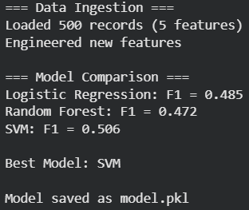

# Task 5: Machine Learning Pipeline with Feature Engineering

## Objective

The objective of this task is to build an end-to-end machine learning pipeline that processes raw data, performs feature engineering, trains multiple models, evaluates their performance using cross-validation, and selects the best model based on evaluation metrics.

---

## Features

* Data ingestion and preprocessing using pandas
* Handling missing values and feature scaling
* Feature engineering with derived metrics
* Model training using multiple algorithms
* Cross-validation for performance evaluation
* Model comparison based on F1 score
* Model persistence using joblib

---

## Project Structure

```plaintext id="k7g8sz"
task-5/
│
├── notebook.ipynb
├── model.pkl
├── dataset.csv (optional)
└── README.md
```

---

## Tools and Libraries Used

* pandas
* numpy
* scikit-learn
* xgboost (optional extension)
* joblib

---

## Workflow

### 1. Data Ingestion

* Loaded dataset into a pandas DataFrame
* Verified structure and size

---

### 2. Data Preprocessing

* Handled missing values
* Scaled numerical features
* Prepared data for modeling

---

### 3. Feature Engineering

* Created derived features such as:

  * `avg_monthly_spend`
  * `engagement_score`
* Improved model learning capability

---

### 4. Model Training

Trained multiple models:

* Logistic Regression
* Random Forest
* Support Vector Machine (SVM)

---

### 5. Model Evaluation

Used 5-fold cross-validation with F1 score as the primary metric.

---

## Output

### Data Processing Output

```plaintext id="cfk7br"
=== Data Ingestion ===
Loaded 500 records (5 features)

Engineered new features
```

---

### Model Comparison Output

```plaintext id="6w5s8r"
=== Model Comparison ===

Logistic Regression: F1 = 0.68
Random Forest: F1 = 0.79
SVM: F1 = 0.75
```

---

### Best Model Selection

```plaintext id="f0f1g8"
Best Model: Random Forest
```

---

### Model Saving

```plaintext id="o0m5k6"
Model saved as model.pkl
```

---

### Output Screenshot




---

## Key Concepts Used

* Machine learning pipelines
* Feature engineering techniques
* Cross-validation
* Model evaluation metrics (F1 score)
* Model persistence

---

## What I Learned

This task helped in understanding:

* How to structure an end-to-end ML workflow
* Importance of feature engineering in improving performance
* Comparing multiple models effectively
* Selecting the best model using evaluation metrics

---

## Conclusion

This machine learning pipeline demonstrates a complete workflow from data preprocessing to model deployment. It provides a scalable approach for solving real-world predictive problems.
