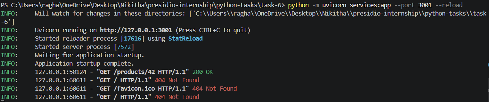

# Task 6: Async API Gateway with Rate Limiting, Caching, and Circuit Breaker

## Objective

The objective of this task is to build an asynchronous API gateway that acts as a reverse proxy to route requests to downstream services. The system incorporates rate limiting, response caching, and circuit breaker mechanisms to ensure reliability and performance.

---

## Features

* Reverse proxy routing to downstream services
* Token-bucket rate limiting per API key
* Response caching with TTL
* Circuit breaker for handling service failures
* Asynchronous request handling using FastAPI and aiohttp
* Structured request logging for monitoring

---

## Project Structure

```plaintext id="8j2k7p"
task-6/
│
├── gateway.py
├── services.py
├── requirements.txt
```

---

## Prerequisites

* Python 3.x
* Basic understanding of APIs and HTTP requests

---

## Installation

Install required dependencies:

```bash id="t8s1d4"
pip install -r requirements.txt
```

---

## How to Run

### Step 1: Start Mock Services

```bash id="m4p2q1"
uvicorn services:app --port 3001
```

---

### Step 2: Start API Gateway

```bash id="k1v9c3"
uvicorn gateway:app --port 8080
```

---

### Step 3: Send Requests

Open browser or Postman:

```plaintext id="z6q8y2"
http://localhost:8080/api/products/42
http://localhost:8080/api/orders/101
http://localhost:8080/api/users/1
```

---

## Output

### Gateway Startup

```plaintext id="w7d4k1"
[INFO] API Gateway running on http://0.0.0.0:8080
[INFO] Routes loaded:
       /api/users/**    -> http://localhost:3001
       /api/orders/**   -> http://localhost:3001
       /api/products/** -> http://localhost:3001
```

---

### Request Logs

```plaintext id="r9x3m2"
[REQ] GET /api/products/42
      -> CACHE HIT — 200 OK

[REQ] GET /api/orders/101
      -> PROXY SUCCESS — 200 OK

[REQ] POST /api/users/signup
      -> RATE LIMITED — 429 Too Many Requests

[REQ] GET /api/orders/7891
      -> CIRCUIT OPEN — 503 Service Unavailable
```

---

### Output Screenshot



---

## Key Concepts Used

* Asynchronous programming using asyncio
* FastAPI for building API gateway
* Reverse proxy design pattern
* Token-bucket rate limiting algorithm
* Caching with TTL
* Circuit breaker pattern for fault tolerance

---

## What I Learned

This task helped in understanding:

* How API gateways manage and route traffic
* Implementing rate limiting for API protection
* Using caching to improve performance
* Handling failures gracefully with circuit breakers
* Building scalable backend systems

---

## Conclusion

This API gateway demonstrates how modern systems handle routing, performance optimization, and fault tolerance. It serves as a simplified but practical version of real-world API gateway architectures used in microservices-based systems.
