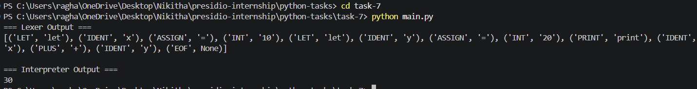

# Task 7: Compiler / Interpreter for a Mini Language

## Objective

The objective of this task is to design and implement a mini programming language interpreter. This includes building a lexer (tokenizer), parser (syntax analyzer), abstract syntax tree (AST), and an interpreter to execute the parsed code.

---

## Features

* Tokenization of source code into meaningful tokens
* Parsing tokens into an Abstract Syntax Tree (AST)
* Support for variables and arithmetic expressions
* Execution of statements using an interpreter
* Basic print functionality
* Modular architecture (lexer, parser, AST, interpreter)

---

## Project Structure

```plaintext id="9s7d3k"
task-7/
│
├── lexer.py
├── parser.py
├── interpreter.py
├── ast_nodes.py
├── main.py
└── sample.txt
```

---

## How It Works

### 1. Lexer (Tokenization)

* Converts raw source code into tokens
* Identifies keywords, identifiers, numbers, operators, and symbols

---

### 2. Parser

* Processes tokens and constructs an Abstract Syntax Tree (AST)
* Represents the structure of the program

---

### 3. AST (Abstract Syntax Tree)

* Tree-based representation of program logic
* Each node represents expressions, variables, or operations

---

### 4. Interpreter

* Walks through the AST
* Executes statements and evaluates expressions

---

## Example Source Code

```plaintext id="q3k2h9"
let x = 10
let y = 20
print x + y
```

---

## Output

### Lexer Output

```plaintext id="k8f1a2"
[('LET', 'let'), ('IDENT', 'x'), ('ASSIGN', '='), ('INT', '10'),
 ('LET', 'let'), ('IDENT', 'y'), ('ASSIGN', '='), ('INT', '20'),
 ('PRINT', 'print'), ('IDENT', 'x'), ('PLUS', '+'), ('IDENT', 'y'),
 ('EOF', None)]
```

---

### Interpreter Output

```plaintext id="m4z9c1"
30
```

---

### Output Screenshot



(Add a screenshot showing both lexer output and interpreter result)

---

## Key Concepts Used

* Lexical analysis (tokenization)
* Recursive descent parsing
* Abstract Syntax Trees (AST)
* Tree traversal and evaluation
* Basic compiler/interpreter design principles

---

## What I Learned

This task helped in understanding:

* How programming languages are interpreted internally
* The role of lexers and parsers in compilers
* How ASTs represent program structure
* Execution of code through tree traversal

---

## Conclusion

This mini interpreter demonstrates the core building blocks of a programming language. It provides a foundational understanding of how compilers and interpreters process and execute code, forming the basis for more advanced language design and execution systems.
