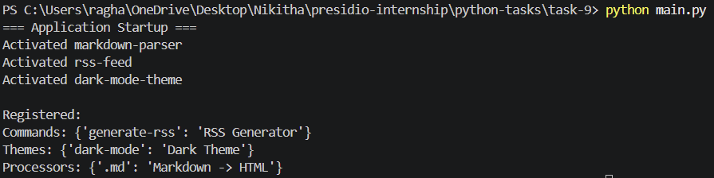

# Plugin Architecture with Dynamic Module Loading

## Overview

This project implements a modular plugin system that dynamically discovers, loads, and manages plugins at runtime. It supports dependency resolution, lifecycle hooks, and extensible registries.

## Features

* Dynamic plugin discovery using importlib
* Plugin lifecycle: activate/deactivate
* Dependency resolution using topological sorting
* Central registry for commands, themes, and processors
* Extensible architecture without modifying core logic

## Project Structure

```
core/        -> Core plugin system
plugins/     -> Independent plugin modules
cli.py       -> Application entry point
```

## How to Run

```bash
python -m venv venv
venv\Scripts\activate
python cli.py
```

## Example Output

```
[CORE] Scanning plugin directory: ./plugins/
[CORE] Discovered 4 plugins
[CORE] Resolving dependencies...
[CORE] Activating plugins...
```

## Future Improvements

* Entry point support via pyproject.toml
* Plugin sandboxing
* Async plugin execution
* CLI integration with argparse

## Output 

